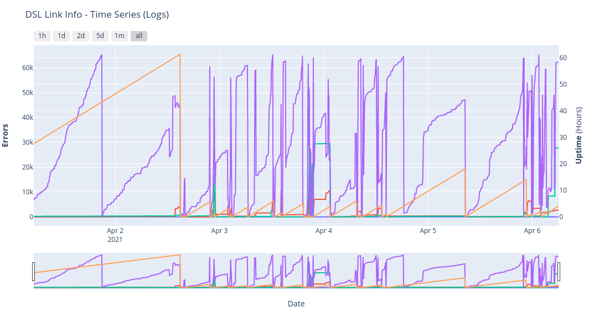

# DSL Info Bot


## Table of Contents
- [About](#about)
- [Table of Contents](#table-of-contents)
- [Instalation](#instalation)
  - [Clone Repository](#clone-repository)
  - [Python Virtual Environment](#python-virtual-environment)
  - [Download Web-Driver for Selenium](#download-web-driver-for-selenium)
  - [Add Environmental Variables](#add-environmental-variables)
- [Run Program](#run-program)
- [Run Plot Script](#run-plot-script)
- [Create a Cron Job](#create-a-cron-job)
- [InfluxDB](#influxdb)
- [To-Do](#to-do)


## About
A python bot, that uses [Selenium](https://www.selenium.dev/), in order to automatically access the Router/Modem's web-based setup page and get DSL Link info. It uses [Plotly](https://plotly.com/) to create an interactive Plot as an HTML web page.

It also supports the export of the data to an [InfluxDB](https://www.influxdata.com/) Bucket for further monitoring and visualizing.
 
Currently gets the following info:
- CRC Errors
- FEC Errors
- Showtime_start

Support for the following Routers/Modems:
- ZTE Nova Routers (H267N, H288A, ...)

## Instalation

### Clone Repository
Clone the repo:
```bash
git clone https://github.com/thanoskoutr/DSL-Info-Bot.git
```

Change directory:
```bash
cd DSL-Info-Bot
```

### Python Virtual Environment

#### Install venv
On Debian/Ubuntu systems, you need to install the `python3-venv` package using the following command:
```bash
sudo apt-get install python3-venv
```

#### Create virtual environment
Create a virtual environment on the top directory of the project:
```bash
python3 -m venv env
```

#### Activate the virtual environment
```bash
source env/bin/activate
```

#### Install required dependencies
```bash
python3 -m pip install -r requirements.txt
# or
pip3 install -r requirements.txt
```
Minimum Python version tested: `Python 3.6.9`
Maximum Python version tested: `Python 3.8.5`

##### Dependencies
You can install manually, without a virtual environment, the project dependencies:
- [selenium](https://pypi.org/project/selenium/)
```bash
pip install selenium 
```
- [pandas](https://pypi.org/project/pandas/)
```bash
pip install pandas 
```
- [plotly](pip install plotly)
```bash
pip install plotly 
```
### Download Web-Driver for Selenium
Selenium requires a driver to interface with the chosen browser. For this project the Chrome and Firefox driver is supported, used in *headless* mode in order to not require a GUI.

#### Install Chromium
In order to use the chromium driver, chromium or chrome needs to be installed. If you have already a chrome installation in your system, there is nothing to be done. Else, install a chrome version.

For Ubuntu 20.04, use `wget` to download the latest Google Chrome `.deb` package:
```bash
wget https://dl.google.com/linux/direct/google-chrome-stable_current_amd64.deb
```

Install Google Chrome package:
```bash
sudo apt install ./google-chrome-stable_current_amd64.deb
```

#### Download Chrome Driver
Download the chrome browser driver, based on the installed chromium version in your system from this [link](https://sites.google.com/chromium.org/driver/) 


Check Chrome version:
```bash
google-chrome --version
```

For the Chrome version 89 driver, for Linux 64-bit, download with:
```bash
wget https://chromedriver.storage.googleapis.com/89.0.4389.23/chromedriver_linux64.zip
```

Extract the driver, using `unzip`:
```bash
unzip chromedriver_linux64.zip
```

#### Install Mozilla Firefox
In order to use the firefox driver, Firefox needs to be installed. If you have already a Firefox installation in your system, there is nothing to be done. Else, install a Firefox version from [here](https://www.mozilla.org/en-US/firefox/download/thanks/) or: 

For Ubuntu/Debian Distros
```bash
sudo apt install firefox
```

For Arch/Arch based Distros
```bash
sudo pacman -S firefox
```


#### Download Firefox Driver
Download the Firefox browser driver, based on the installed Firefox version in your system from this [link](https://github.com/mozilla/geckodriver/releases)

Check Firefox version:
```bash
firefox --version
```

For the latest Firefox version driver, for Linux 64-bit, download with:
```bash
wget https://github.com/mozilla/geckodriver/releases/download/v0.31.0/geckodriver-v0.31.0-linux64.tar.gz
```

Extract the driver, using `tar`:
```bash
tar -zxvf geckodriver-v0.29.0-linux64.tar.gz
```

#### Add driver to PATH
In order for selenium to use the binary driver, it has to be in the `PATH` environmental variable. The preferred place for local binaries is to place the driver in the `/usr/local/bin` directory:
```bash
# For Chrome Driver
# Run from the location where your binary is downloaded and extracted
sudo mv chromedriver /usr/local/bin
# For Firefox Driver
# Run from the location where your binary is downloaded and extracted
sudo mv geckodriver /usr/local/bin
```

#### Selenium Guides - Documentation
- [Selenium with Python](https://selenium-python.readthedocs.io/index.html)
- [Selenium Documentation](https://www.selenium.dev/documentation/en/)


### Add Environmental Variables
Create the `.env` file from `.env-test`:
```bash
cp .env-test .env
```

Fill in the environmental variables needed:
- Router's web-based setup page (like `http://192.168.1.1/`)
- Router's Username
- Router's Password

```bash
ROUTER_PAGE=http://192.168.1.1/
ROUTER_USERNAME=username
ROUTER_PASSWORD=password
```

## Run Program
From the project's top directory, run:
```bash
python3 main.py
```

- A file named `dsl_info.csv` should be created in the directory that contains the fetched info.
- A file named `dsl_info_headers.csv` should be created in the directory that contains the info headers.
- Firefox is the default browser, running without GUI.

### Run Program with arguments
From the project's top directory, run with `help` option to see all available options:
```
$ python3 main.py -h

usage: main.py [-h] [-d {firefox,chrome}] [--headless {True,False}] [-t TIMEOUT] [-f FILE]

DSL-Info-Bot - A python bot, that uses Selenium, in order to automatically access the Router/Modem's web-based setup page and get DSL Link
info.

optional arguments:
  -h, --help            show this help message and exit
  -d {firefox,chrome}, --driver {firefox,chrome}
                        The browser driver to use.
  --headless {True,False}
                        Run without a GUI.
  -t TIMEOUT, --timeout TIMEOUT
                        The maximum time to wait for page loading.
  -f FILE, --file FILE  The file name of the csv where the data will be saved.
```

## Run Plot Script
From the project's top directory, run:
```bash
python3 create_plot.py
```
- Reads the `.csv` files with the headers and the data
- Creates a `plot.html` file that can be viewed on a browser.

### Run Plot Script with arguments
From the project's top directory, run with `help` option to see all available options:
```
$ python3 create_plot.py -h

usage: create_plot.py [-h] [-c CSV] [-d CSV_HEADERS]

A plot script in order to visualize the data in the csv file.

optional arguments:
  -h, --help            show this help message and exit
  -c CSV, --csv CSV     The file name of the csv with the data.
  -d CSV_HEADERS, --csv_headers CSV_HEADERS
                        The file name of the csv with the data headers.
```

### Serve Plot - View on Browser
If you are in a headless environment you can serve the `.html` files using the `http.server` python module.

By running this command from the project's top directory, you'll be able to access the files in your directory through your browser at `localhost:8420`:
```bash
python3 -m http.server 8420
```
There are more elegant (and safe) ways to do this, but this is a quick and dirty solution.

## Create a Cron Job
In order to run the script after a time interval on a linux machine:

Open crontab:
```bash
crontab -e
```

In order to run the script every 5 minutes, change the path to the repo accordingly:
```bash
*/5 * * * * /usr/bin/env bash -c 'export PATH="/usr/local/bin:$PATH" && source /path/to/DSL-Info-Bot/env/bin/activate && python3 /path/to/DSL-Info-Bot/main.py'
```

In order to run the script, update the plot every 5 minutes and serve the html plot, change the path to the repo accordingly:
```bash
*/5 * * * * /usr/bin/env bash -c 'export PATH="/usr/local/bin:$PATH" && source /path/to/DSL-Info-Bot/env/bin/activate && python3 /path/to/DSL-Info-Bot/main.py && python3 /path/to/DSL-Info-Bot/create_plot.py'
@reboot cd /path/to/DSL-Info-Bot && python3 -m http.server 8420 > /dev/null 2>&1
```

We need to use the bash shell in order to execute the `source` command and we need to export the `PATH` variable in order for cron to be able to find the driver.

The `dsl-info.csv` file should be created or updated in the repo directory.

## InfluxDB
In order to add `dsl_info.csv` to a InfluxDB Bucket, we have to convert theme using the `convert_times.py` script that converts the `showtime_start_value` and the `current_date` values to `duration` and `timestamp` data formats that InfluxDB can process. 

To do that, create a new `dsl_info.csv` file:
```bash
mv dsl_info.csv dsl_info_influxdb.csv
```

And convert the fields on the new `dsl_info_influxdb.csv` file:
```bash
python3 convert_times.py dsl_info_influxdb.csv
```

Now we can add them to a `DSL-Info` bucket using the following commands, by passing only one measurement at each time:
```bash
influx write dryrun -b DSL-Info -f dsl_info_influxdb.csv \
--header "#constant measurement,errors" \
--header "#datatype long,ignored,ignored,ignored,ignored,dateTime:RFC3339" \
--header "errors_crc_up,errors_crc_down,errors_fec_up,errors_fec_down,showtime_start_value,current_date"

influx write dryrun -b DSL-Info -f dsl_info_influxdb.csv \
--header "#constant measurement,errors" \
--header "#datatype ignored,long,ignored,ignored,ignored,dateTime:RFC3339" \
--header "errors_crc_up,errors_crc_down,errors_fec_up,errors_fec_down,showtime_start_value,current_date"

influx write dryrun -b DSL-Info -f dsl_info_influxdb.csv \
--header "#constant measurement,errors" \
--header "#datatype ignored,ignored,long,ignored,ignored,dateTime:RFC3339" \
--header "errors_crc_up,errors_crc_down,errors_fec_up,errors_fec_down,showtime_start_value,current_date"

influx write dryrun -b DSL-Info -f dsl_info_influxdb.csv \
--header "#constant measurement,errors" \
--header "#datatype ignored,ignored,ignored,long,ignored,dateTime:RFC3339" \
--header "errors_crc_up,errors_crc_down,errors_fec_up,errors_fec_down,showtime_start_value,current_date"

influx write -b DSL-Info -f dsl_info_influxdb.csv \
--header "#constant measurement,errors" \
--header "#datatype ignored,ignored,ignored,ignored,duration,dateTime:RFC3339" \
--header "errors_crc_up,errors_crc_down,errors_fec_up,errors_fec_down,showtime_start_value,current_date"
```

## To-Do

- [ ] ! Fix waiting time (Timeout) for ButtonApply
- [ ] Create Classes for other Routers/Modems
- [ ] Check for corner cases Errors
- [ ] Add more arguments (?)
- [ ] Make Class Methods more abstract
- [ ] Add comments for Documentation
- [ ] Setup File Structure
- [ ] Plot: Make with classes / Make it reconfigurable
- [ ] ! Plot: Add speedtest logs plot
- [ ] InfluxDB: Add types
- [ ] InfluxDB: Find best representation
